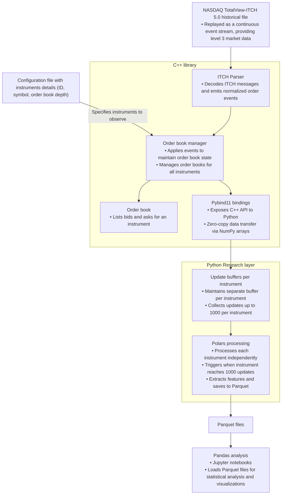

# ITCH Market Data Engine

This project's goal is to create a C++20 library, exposed to Python through pybind11, that parses NASDAQ TotalView-ITCH 5.0 messages and reconstructs per-instrument order books for market microstructure analysis.

## Current status

### ITCH parser

- Read binary ITCH file sequentially.
- Handle endianness (from big-endian to little-endian).
- Minimizes overhead by reading directly from the buffer.

### Supported ITCH 5.0 Messages

#### Stock related messages

| Type | Message | Description |
|------|---------|-------------|
| `S` | `SystemEvent` | Used to signal a market or data feed handler event. |
| `R` | `StockDirectory` | Sent at the start of each trading day for all active symbols. |
| `H` | `StockTradingAction` | Indicate the current trading status of a security: halted (H), paused (P), quote-only (Q), or trading (T). |

#### Order related messages

| Type | Message | Description |
|------|---------|-------------|
| `A` | `AddOrder` | A new order has been accepted and was added to the order book (no MPID attribution). |
| `F` | `AddOrderMPID` | A new order has been accepted and was added to the order book (MPID attribution). |
| `E` | `OrderExecuted` | An order on the book was executed in whole or in part at its display price. |
| `C` | `OrderExecutedWithPrice` | An order on the book was executed in whole or in part at a price different from the initial display price. |
| `X` | `OrderCancel` | An order on the book was partially canceled, which reduces shares on an existing order. |
| `D` | `OrderDelete` | An order on the book was cancelled entirely and must be removed from the book. |
| `U` | `OrderReplace` | An order on the book was cancelled and replaced with a new order. |

## Architecture diagram



## Stack used

- Build system: [CMake](https://cmake.org/), a cross-platform build system generator.
- Package manager: [Conan](https://conan.io/), a C/C++ dependency manager widely used in production environments.

## Getting started

### Requirements

The project requires the following to run:

- [CMake](https://cmake.org/): if not installed, refer to the [installation guide](https://cmake.org/download/).
- [Conan](https://conan.io/): if not installed, refer to the [installtion guide](https://docs.conan.io/2/installation.html).

Run the following command:
```sh
conan profile detect --force
```

### Dataset

Download raw ITCH 5.0 data `01302020.NASDAQ_ITCH50.gz` from `https://emi.nasdaq.com/ITCH/Nasdaq%20ITCH/`.

Samples are available in `examples/` folder.

The data format is defined by the document [Nasdaq TotalView-ITCH 5.0](https://www.nasdaqtrader.com/content/technicalsupport/specifications/dataproducts/NQTVITCHspecification.pdf).

### Installation

1. Clone the git repository.
```sh
git clone git@github.com:sephorah/ITCH-market-data-engine.git
cd ITCH-market-data-engine
```

2. Install dependencies.
```sh
./bin/setup.sh install
```

3. Build the project.
```sh
./bin/setup.sh build
```

4. Run tests.
```sh
./bin/setup.sh tests
```
